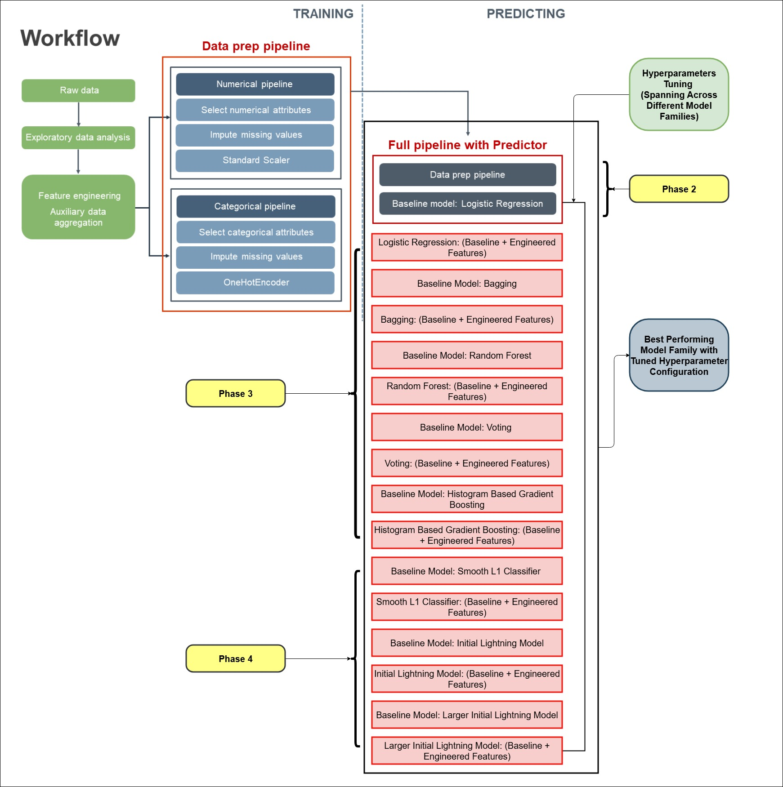

# Home Credit Default Risk Prediction

This project builds and evaluates machine learning models for the **Home Credit Default Risk** Kaggle competition. The goal is to predict whether a loan applicant is likely to default, using demographic, financial, credit, and historical repayment information.

The project focuses on creating a clean, leakage-free modeling workflow, comparing baseline models with engineered-feature models, and evaluating whether ensemble methods or neural networks perform better on structured credit-risk data.

## Project Overview

Many applicants have limited or non-traditional credit histories, which makes lending decisions difficult. The Home Credit dataset provides alternative customer information such as income, annuity amount, employment history, family details, external credit scores, bureau records, and prior installment behavior.

This project uses that data to answer the central question:

> Can we predict how capable each applicant is of repaying a loan?

## Repository Contents

```text
.
├── HomeCreditDR.ipynb                         # Main project notebook
├── HCDR_Experiment_Log_1-1.csv                # Hyperparameter tuning results
├── HCDR_Experiment_Log_2-1.csv                # Final model comparison results
├── HomeCreditDR.PNG                           # Kaggle leaderboard/submission screenshot
├── HomeCreditDR_Overview_Modeling_Pipelines.jpg # Modeling workflow diagram
└── README.md
```

## Dataset

The project uses the **Home Credit Default Risk** dataset from Kaggle.

Main dataset used:

- `application_train.csv`

Additional auxiliary tables used for engineered features include:

- `bureau.csv`
- `installments_payments.csv`

The target variable is:

- `TARGET = 1`: applicant had payment difficulty/defaulted
- `TARGET = 0`: applicant repaid successfully

The main training table contains approximately:

- **307,511 rows**
- **122 original columns**
- Mixed numeric and categorical variables
- Significant missing values
- Strong class imbalance

Because the Kaggle dataset is large, the raw data is not included in this repository. Download it from Kaggle and place the extracted files inside a local data directory before running the notebook.

## Modeling Workflow

The workflow follows a structured training and prediction process:



## How to Run the Project

### 1. Clone the repository

```bash
git clone https://github.com/YOUR_USERNAME/YOUR_REPOSITORY_NAME.git
cd YOUR_REPOSITORY_NAME
```

### 2. Create a virtual environment

```bash
python -m venv venv
source venv/bin/activate
```

For Windows:

```bash
venv\Scripts\activate
```

### 3. Install dependencies

```bash
pip install numpy pandas scikit-learn matplotlib seaborn torch pytorch-lightning
```

### 4. Download the dataset

Download the Home Credit Default Risk dataset from Kaggle and place the extracted files in the expected local data directory used by the notebook.

Expected structure:

```text
DATA_DIR/
├── application_train.csv
├── application_test.csv
├── bureau.csv
├── bureau_balance.csv
├── previous_application.csv
├── installments_payments.csv
├── credit_card_balance.csv
├── POS_CASH_balance.csv
└── sample_submission.csv
```

### 5. Run the notebook

Open and execute:

```text
HomeCreditDR.ipynb
```

You can use Jupyter Notebook, JupyterLab, or VS Code.


The strongest result came from Histogram-Based Gradient Boosting, confirming that gradient-boosted tree methods are highly effective for structured financial-risk datasets.
